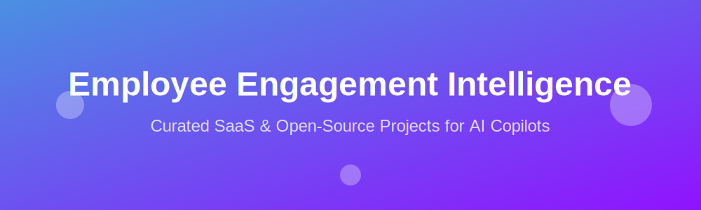

# 🌟 Awesome-Employee-Engagement-Intelligence 🌟

  

  

## 🚀 AI-Powered Employee Engagement Copilot Ecosystem

**Curated List of SaaS Products & Open-Source GitHub Projects** 📋 
*Focused on AI Employee Engagement Copilots* 🤖
**Last updated: March 2026** 📅

This repository tracks notable **SaaS platforms** and **open-source projects** building **AI-powered employee engagement copilots** — autonomous or semi-autonomous agents that boost workplace culture through real-time feedback analysis, sentiment tracking, personalized recognition, pulse surveys, action recommendations, burnout detection, and proactive engagement interventions.

**Examples** include Microsoft 365 Copilot (with Viva), Empuls AI Copilot, and Braid (the category leaders). Tools listed here emphasize **agentic capabilities** (multi-step reasoning, sentiment analysis, automated survey generation, insight summarization, personalized nudges, and workflow automation) to drive measurable improvements in employee experience, retention, and productivity.

**Open-source emphasis**: This section is heavily expanded with every major active project for self-hosting, local LLMs (Ollama), sentiment analysis, pulse surveys, feedback agents, and full data privacy control — perfect for organizations wanting custom, on-premise employee engagement agents.

Contributions welcome! Open a PR to add/update entries. Keep descriptions factual and link to official sites.

## Table of Contents
- [SaaS Products](#saas-products)
- [Open-Source GitHub Projects](#open-source-github-projects)
- [How to Contribute](#how-to-contribute)
- [Disclaimer](#disclaimer)

## SaaS Products

### Core Platforms (AI Employee Engagement Copilots)

| Platform | Description | Pricing | Free Tier Limit | Company Size |
|----------|-------------|---------|-----------------|--------------|
| **[Microsoft 365 Copilot + Viva](https://www.microsoft.com/en-us/microsoft-copilot/)** | Enterprise AI copilot deeply integrated with Microsoft 365 and Viva suite. Provides sentiment analysis from communications, engagement insights, personalized wellness suggestions, meeting summaries, and HR-specific agents to improve employee experience and productivity. | ~$30 per user/month | No free tier | ~$3 Trillion |
| **[Empuls by Xoxoday](https://www.xoxoday.com/empuls/)** | AI-powered employee engagement platform with a dedicated **AI Copilot**. Automates survey creation, recognition notes, insights generation, achievement tracking, and actionable recommendations. Strong in rewards, recognition, and real-time engagement for modern workplaces. | Starts at ~$49/month | No free tier (30-day trial) | Est. ~$250 Million+ |
| **[Braid](https://www.braid.ai/)** (or similar AI engagement platforms) | AI-driven employee engagement copilot focused on real-time conversation intelligence, feedback loops, and cultural insights from internal communications and surveys. | Custom Pricing | No free tier | Est. ~$15 Million |

### Advanced & Specialized Platforms

| Platform | Description | Pricing | Free Tier Limit | Company Size |
|----------|-------------|---------|-----------------|--------------|
| **[Culture Amp](https://www.cultureamp.com/)** | Leading employee experience platform with AI-powered engagement surveys, sentiment analysis, and intelligent action planning. | Custom Pricing | No free tier | ~$1.5 Billion |
| **[15Five](https://www.15five.com/)** | Performance and engagement platform with AI-summarized insights, pulse surveys, and manager coaching recommendations. | Starts at $4 user/month | No free tier (14-day trial) | Est. ~$1 Billion |
| **[Leena AI](https://www.leena.ai/)** | HR-focused AI chatbot and copilot for instant answers, engagement surveys, sentiment tracking, and personalized employee support. | Custom Pricing | No free tier (Free trial available) | Est. ~$150 Million |

**Other notable mentions**: Workvivo, Peakon (Workday), Lattice, Motivosity, and custom agents built with Copilot Studio.

## Open-Source GitHub Projects

### Dedicated Employee Engagement & Feedback Agent Projects

- **[agent-for-hr-service-solution-accelerator](https://github.com/microsoft/agent-for-hr-service-solution-accelerator)**   
  Microsoft’s official open-source HR AI agent. Delivers instant policy answers, automates record updates, summarizes feedback, and enhances employee experience — easily extendable for engagement copilots.

- **[Open Pulse Survey](https://github.com/BrainStation-23/openofficesurvey)** (or openpulsesurvey)   
  Comprehensive open-source employee feedback and pulse survey platform. Supports survey creation, distribution, AI sentiment analysis, custom reports, and actionable insights. Designed for enterprises seeking self-hosted engagement measurement.

- **[Company-Perception-tool-Using-Sentiment-Analysis](https://github.com/kukr/Company-Perception-tool-Using-Sentiment-Analysis)**   
  Tool that mines employee sentiments (with emotion detection) and provides recommendations to improve satisfaction and perception.

- **[Employee-Engagement-Platform](https://github.com/libphoenix/Employee-Engagement-Platform)**   
  Full employee satisfaction and engagement platform using machine learning (random forest + neural networks) for classification and sentiment analysis on feedback data.

- **[Employee_feedback_analysis](https://github.com/sushil79g/Employee_feedback_analysis)**   
  Analyzes employee feedback by department with dual approaches: sentiment scoring and thematic insights for targeted engagement improvements.

- **[Employee-Sentiment-Analysis](https://github.com/FastAndDanger2/Employee-Sentiment-Analysis)**   
  Complete NLP pipeline for assessing employee engagement and sentiment from text feedback, including exploratory data analysis and visualization.

- **[Sentiment_Analysis_on_Employee_Feedback](https://github.com/rudrasish2003/Sentiment_Analysis_on_Employee_Feedback)**   
  Streamlit-based web app for uploading employee feedback (Excel/CSV) and performing real-time sentiment analysis with visualizations and insights.

- **[employee-review-analysis](https://github.com/CDAC-lab/employee-review-analysis)**   
  Advanced employee review analysis with deep sentiment, emotion detection, and contextual understanding using modern NLP techniques.

- **[EmployeeInsights](https://github.com/zohaibshahzadkhan/EmployeeInsights)**   
  Command-line and data-driven employee insight survey analyzer. Processes survey data to generate engagement metrics and recommendations.

### Additional Strong Open-Source Options

- **[Employee_Survey_Analysis](https://github.com/MrBhimani/Employee_Survey_Analysis)**  — Visual insights from nationwide-style employee survey data.
- Sentiment analysis tools built with Hugging Face, TextBlob, or NLTK (many forks available).
- General frameworks like **LangGraph** + **CrewAI** for building multi-agent engagement copilots (survey agent + sentiment agent + recommendation agent + action agent).
- RAG-based systems on internal HR policies combined with feedback data for private, on-prem copilots using Ollama.

**Frameworks for building custom agents**: Use LangGraph/CrewAI with the above sentiment tools + Slack/Teams/MS Teams APIs or email parsers to create fully autonomous employee engagement copilots that run locally or in your private cloud.

## How to Contribute

1. Fork the repo.
2. Add/edit entries in `README.md` (follow existing format).
3. Include: name, link, 1–2 sentence description, and whether it's SaaS or open-source.
4. Submit PR with a short explanation.

Star the repo if you find it useful!

## Disclaimer

- This is a **community-curated** list — not exhaustive and not an endorsement.
- Always verify data privacy (GDPR, CCPA, etc.), security, and compliance when handling sensitive employee feedback and sentiment data, especially with self-hosted open-source tools.
- AI engagement copilots are powerful tools but **not substitutes** for human HR expertise, ethical practices, or direct employee conversations.

---

**Made for HR professionals, people operations teams, and developers.**  
Let's make employee engagement smarter, more responsive, and fully controllable.

##  Star History

<a href="https://www.star-history.com/?repos=ishandutta2007%2FAwesome-Employee-Engagement-Intelligence&type=date&legend=bottom-right">
<picture>
<source media="(prefers-color-scheme: dark)" srcset="https://api.star-history.com/chart?repos=ishandutta2007/Awesome-Employee-Engagement-Intelligence&type=date&theme=dark&legend=bottom-right" />
<source media="(prefers-color-scheme: light)" srcset="https://api.star-history.com/chart?repos=ishandutta2007/Awesome-Employee-Engagement-Intelligence&type=date&legend=bottom-right" />

</picture>
</a>

